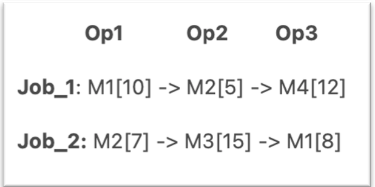

# Genetic Algorithm-Based Job Shop Scheduling System  

## Project Description  

This project implements a **Job Shop Scheduling System** using a **Genetic Algorithm (GA)** in Python for a manufacturing plant equipped with multiple machines and various jobs. Each product in the system requires a specific **sequence of operations** on these machines. The primary goal is to **optimize the scheduling process** to:  
- Minimize overall **production time** (makespan).  
- Maximize **throughput** by efficiently utilizing available resources.  
- Consider **machine capacities** and **job dependencies** while generating schedules.  

The system uses a **Genetic Algorithm** to explore different scheduling possibilities and evolve better solutions over multiple generations.  

## Chromosome Representation  

In this implementation, a **chromosome** is modeled as an **array of genes**, where:  
- Each **gene** uniquely represents an **operation** for a specific job assigned to a particular machine.  
- The **sequence** of genes in the chromosome determines the **order of execution** for each job.  
- The Genetic Algorithm manipulates these chromosomes to improve scheduling efficiency.  

## Job Representation  

Each job consists of **a sequence of operations**, represented as **tuples** containing three key elements:  

- **Machine** – The machine on which the operation is performed, uniquely identified and connected to a specific **operation number**.  
- **Duration** – The time required to complete the operation on the assigned machine.  
- **Operation Index** – Represents the **sequence** in which the job should be executed. This index links the job to a specific machine, determined by the number of times the job appears in the chromosome. It is **automatically indexed** in increasing order based on the number of operations.  

 

## Features  

- `Optimized Scheduling` – Uses **Genetic Algorithm** to generate a new population with a more efficient schedule, reducing idle time and improving throughput.  
- `Gantt Chart Visualization` – Provides a **graphical representation** of the scheduling sequence, displaying job execution timelines across machines.  
- `Fitness Threshold Checking` – Evaluates schedules based on a fitness function and **stops execution when an optimal solution is reached**.  
- `Customizable Parameters` – Allows users to adjust **mutation rates, crossover probabilities, and population size** for fine-tuning GA performance.  

## Contact
For any inquiries, reach out via:

- Email: [miar.taweel04@gmail.com](mailto\:miar.taweel04@gmail.com)
- GitHub: [miarTaweel](https://github.com/miarTaweel)

